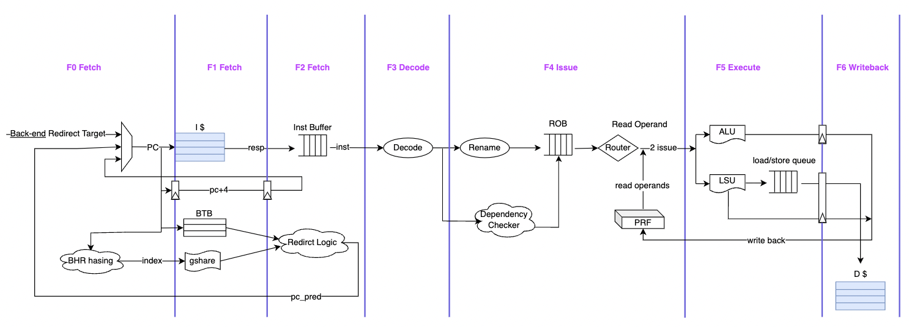

# HEHECORE

## Overview

This is a small out-of-order RISC-V core written in synthesizable Verilog that supports the RV64IC unprivileged ISA and parts of the privileged ISA, namely M-mode.

## Feature List

- It currently supports RISC-V I extension
- It currently supports M mode
- It's a double issue architecture
- It supports scalar register renaming
- It currently supports only in-order issue from the issue queue
- It has a ROB to do in-order committment
- When an exception or an interrupt happens, the ROB will be responsible of when to trigger flush
- It supports dynamic branch prediction(gshare)
- It support out-of-order execution
- nonblocking cache

## Block Diagram

## Pipeline Stages

**1. Fetch**

Instructions are *fetched* from Icache and pushed into a FIFO queue, known as the instruction buffer(fetch buffer) . Looking up the branch target buffer also occurs in this stage, redirecting the fetched instructions as necessary

  **F0 stage:**

    PC_gen will generate the correct PC, the pirority is :*Backend-end redirct target -> predicted PC -> PC+4*.

    Meanwhile, Let PC do hashing with BHR, and get the hash index for Gshare.

  **F1 stage:**

    Sent the PC to Icache for instruction request

    Do*pc+4*

    Use PC to index a BTB entry and get*pc_pred.*

    Use the hash value to index Gshare and get*taken or not-taken*.

  **F2 stage:**

    The response from Icache is put into a FIFO instruction buffer

    Sent*pc+4* to the PC_gen

    In Redirct logic, if Gshare predicts taken, it will sent pc_pred to PC_gen. Otherwise, pc_gen makes no sense.

**2. Decode**

  **F3 stage**

    In this stage, it pulls instructions out of the instruction buffer and generates the appropriate micro-op($\mu$op) to place into the pipeline

- decode <=2 instruction per cycle

**3. Issue**

  **F4 stage**

    The ISA, or “logical”, register specifiers (e.g. x0-x31) are then*renamed* into “physical” register specifiers

    Every instruction will do dependency check with its previous instruction to decide whether instructions will be double issued.

    $\mu$op sitting in the head of ROB wait until all of their source registers are ready and they can read their operand then be issued.  This is the beginning of the out–of–order piece of the pipeline.

- Double issue conditions:
  1. There is no dependency between the two instructions
  2. Function units are both ready
  3. Only arithemetic and load/store instructions can be double issued. (excluding conditional,csr, wfi etc.)

**4. Execute**
  **F5 stage**
  Instructions enter the *Execute* stage where the functional units reside. Issued ALU operations perform their calculation and get results.

  For load&store instruction, first the address are calculated and put into the FIFO load/store queue. The instrution at the head of the queue sends request to Dcache if Dcache is ready.

**5. Wrieback**
  **F6 stage**
  results are written back to physical registers when completing instruction and update ROB status

- About branch prediction
  If it's a branch instruction, the result will update Gshare and GHR. If it's mispredicted, the instruction buffer will be flushed, and instructions will be fetched from the other path.

**6. Instruction commit**
The Reorder Buffer (ROB), tracks the status of each instruction in the pipeline. When the head of the ROB is not-busy, the ROB commits the instruction.

- instructions will be commited in order in ROB according to program order, at most 2 instructions can be commited at the same time

# Blcok Description

## Instruction Fetch Unit

#### F0: PC generation

   Select the current pc address, whether it comes from a jump instruction or whether to judge branch in BTB and gshare or whether it comes from an exception. The default value is pc+4.

#### F1: fetch instruction

   Instructions from Icache are put into the instruction buffer.

### Pc_gen

  Perform pc+4 or use the pc from other places.

- **content**

| PC | 

- **input/output**
- | signal             | I/O | width |              description              | interaction |
  | :----------------- | :-: | :---: | :------------------------------------: | :---------: |
  | is_req_pc          |  I  |   1   |       judge if btb need wirte in       |     fu     |
  | btb_req_pc         |  I  |  32  |             btb needed pc             |     fu     |
  | btb_predict_target |  I  |  32  |          btb needed target pc          |     fu     |
  | prev_pc            |  I  |  32  |              pc to gshare              |     fu     |
  | prev_branch_in     |  I  |   1   |     if this pc is a branch or jump     |     fu     |
  | prev_taken         |  I  |   1   |        if this branch is taken        |     fu     |
  | rd_en              |  I  |   1   | decode is ready and want a instruction |   decoder   |
  | pc_out             |  O  |  32  |                a pc out                |   decoder   |
  | next_pc_out        |  O  |  32  |           this pc out plus 4           |   decoder   |
  | instruction_out    |  O  |  32  |         this pc's instruction         |   decoder   |
  | valid_real_branch  |  I  |   1   |     if fu give a valid real branch     |     fu     |
  | real_branch        |  I  |  32  |   this real branch or jump branch pc   |     fu     |
  | trap               |  I  |   1   |               judge trap               |  writeback  |
  | mret               |  I  |   1   |               judge mret               |  writeback  |
  | trap_vector        |  I  |  32  |             vector of trap             |     csr     |
  | mret_vector        |  I  |  32  |             vector of mret             |     csr     |
  | stall              |  I  |   1   |             if need stall             |   hazard   |
  | invalidate         |  I  |   1   |            if is invalidate            |   hazard   |
  | fetch_address      |  O  |  32  |               pc address               |    busio    |
  | fetch_data         |  I  |  32  |              instruction              |    busio    |
  | exception_valid_o  |  O  |   1   |            exception valid            |     csr     |
  | ecause_o           |  O  |   1   |            exception cause            |     csr     |

### BTB

instructions first go into the BTB, if there is a hit, pc = pc_from_btb; if match fail, PC = PC +4, after execute stage, BTB will be update

### Revision History

| Revision Number | Author     | Date       | Description       |
| --------------- | ---------- | ---------- | ----------------- |
| 0.1             | Xinze Wang | 2022.08.10 | init              |
| 0.2             | Xinze Wang | 2022.08.18 | update self check |

- **content**
  [x_btb] entry:

| pc_current | pc_target| 

- **input/output**
- | signal         | I/O | width |        description        | interaction |
  | :------------- | :-: | :---: | :-----------------------: | :---------: |
  | pc_in          |  I  |  32  |        from PC_gen        |    fetch    |
  | next_pc_out    |  O  |  32  | =pc_target or =pc_current |    fetch    |
  | token          |  O  |   1   |   to instruction buffer   |    fetch    |
  | req_pc         |  I  |  32  |        update btb        |   execute   |
  | predict_target |  I  |  32  |        update btb        |   execute   |

### Gsahre

instructions first go into the Gshare, and Gshare will give a prediction, and at execute stage, this prediction will update

 **content**
  [gshare] entry:

### Revision History

| Revision Number | Author       | Date       | Description |
| --------------- | ------------ | ---------- | ----------- |
| 0.1             | Qiaowen Yang | 2022.08.10 | init        |

| gshare |  

- **input/output**
- | signal         | I/O | width |         description         | interaction |
  | :------------- | :-: | :---: | :--------------------------: | :---------: |
  | pc             |  I  |  32  |         from PC_gen         |    fetch    |
  | cur_pred       |  O  |   1   |      give a prediction      |    fetch    |
  | prev_branch_in |  I  |   1   | whether prev instr is branch |   execute   |
  | prev_taken     |  I  |   1   |   whether prev instr taken   |   execute   |
  | prev_pred      |  I  |   1   |    prev instr pred result    |   execute   |
  | prev_mispred   |  O  |   1   |  whether prev instr mispred  |   execute   |

### instruction buffer

### Revision History

| Revision Number | Author     | Date       | Description |
| --------------- | ---------- | ---------- | ----------- |
| 0.1             | Xinze Wang | 2022.08.10 | init        |

- **content**
  [x_ib] entry:

  
| PC(32)| instruction(32) | btb_tag 

- **input/output**
- | signal          | I/O | width |      description      | interaction |
  | :-------------- | :-: | :---: | :-------------------: | :---------: |
  | pc_in           |  I  |  32  |      from PC_gen      |    fetch    |
  | next_pc_in      |  I  |  32  |      from PC_gen      |    fetch    |
  | instruction_in  |  I  |  32  |      from PC_gen      |    fetch    |
  | pc_out          |  O  |  32  |    give to decode    |   decode   |
  | next_pc_out     |  O  |  32  |    give to decode    |   decode   |
  | instruction_out |  O  |  32  |    give to decode    |   decode   |
  | wr_en           |  I  |   1   |      want write      |    fetch    |
  | ins_full        |  O  |   1   |      stall pc in      |    fetch    |
  | rd_en           |  I  |   1   | judge decode is ready |   decode   |

## Instruction Decode Unit

### Decoder

This decoder supports RV64I instructions. It gets the instr from fetch unit and gives the result to ROB unit. For branch instr, it will output a stall flag, until everything is ready.

### Revision History

| Revision Number | Author     | Date       | Description |
| --------------- | ---------- | ---------- | ----------- |
| 0.1             | Guohua Yin | 2022.08.16 | init        |
| 0.2             | Guohua Yin | 2022.08.22 | update      |

### Items

| Item Name | Description                                                 |
| --------- | ----------------------------------------------------------- |
| decode    | decode the instruction in-order from the instruction buffer |

- **content**
- **input/output**
- | signal                    | I/O | width |                 description                 | interaction |
  | :------------------------ | :-: | :---: | :------------------------------------------: | :----------: |
  | clk                       |  I  |   1   |                 clock signal                 |              |
  | rstn                      |  I  |   1   | reset signal, active low, asynchronous reset |              |
  | pc_in                     |  I  |  32  |          get the pc from fetch unit          | instr buffer |
  | next_pc_in                |  I  |  32  |       get the next pc from fetch unit       | instr buffer |
  | instruction_in            |  I  |  32  |           get the instr from fetch           |    fetch    |
  | valid_in                  |  I  |   1   |             get the valid signal             |    fetch    |
  | ready_in                  |  I  |   1   |             get the ready signal             |     rob     |
  | branch_back               |  I  |   1   |           handle the branch stall           |      fu      |
  | trapped                   |  I  |   1   |               pipeline control               |      fu      |
  | wfi_in                    |  I  |   1   |               pipeline control               |      fu      |
  | csr_data                  |  I  |  64  |                 get csr data                 |     csr     |
  | csr_readable              |  I  |   1   |         flag about reading from csr         |     csr     |
  | csr_writeable             |  I  |   1   |          flag about writing to csr          |     csr     |
  | csr_address               |  O  |  12  |                 give to csr                 |     csr     |
  | uses_rs1                  |  O  |   1   |                   use rs1                   |     rob     |
  | uses_rs2                  |  O  |   1   |                   use rs2                   |     rob     |
  | uses_rd                   |  O  |   1   |                    use rd                    |     rob     |
  | uses_csr                  |  O  |   1   |                   use csr                   |     rob     |
  | pc_out                    |  O  |  32  |              give to rob the pc              |     rob     |
  | next_pc_out               |  O  |  32  |           give to rob the next pc           |     rob     |
  | is_csr                    |  O  |   1   |                flag about csr                |     rob     |
  | write_select_out          |  O  |   2   |           write select out signal           |     rob     |
  | rd_address_out            |  O  |   5   |                 give to rob                 |     rob     |
  | csr_address_out           |  O  |  12  |                 give to rob                 |     rob     |
  | mret_out                  |  O  |   1   |                 give to rob                 |     rob     |
  | wfi_out                   |  O  |   1   |                 give to rob                 |     rob     |
  | ecause_out                |  O  |   4   |                 give to rob                 |     rob     |
  | exception_out             |  O  |   1   |                  exception                  |     rob     |
  | half                      |  O  |   1   |                 give to rob                 |     rob     |
  | valid_out                 |  O  |   1   |                  valid flag                  |     rob     |
  | ready_out                 |  O  |   1   |             tell fecth can read             |    fetch    |
  | csr_read_out              |  O  |   1   |                 read signal                 |     rob     |
  | csr_write_out             |  O  |   1   |               csr write signal               |     rob     |
  | csr_readable_out          |  O  |   1   |               csr can be read               |     rob     |
  | csr_writeable_out         |  O  |   1   |                can write csr                |     rob     |
  | csr_data_out              |  O  |  64  |                  to rob alu                  |     rob     |
  | imm_data_out              |  O  |  32  |         to rob alu about immed-data         |     rob     |
  | alu_function_out          |  O  |   3   |                  to rob alu                  |     rob     |
  | alu_function_modifier_out |  O  |   1   |                  to rob alu                  |     rob     |
  | alu_select_a_out          |  O  |   2   |             alu select signal:a             |     rob     |
  | alu_select_b_out          |  O  |   2   |             alu select signal:b             |     rob     |
  | cmp_function_out          |  O  |   3   |           compare function signal           |     rob     |
  | jump_out                  |  O  |   1   |                to rob branch                |     rob     |
  | branch_out                |  O  |   1   |                to rob branch                |     rob     |
  | is_alu_out                |  O  |   1   |                 to rob (lsu)                 |     rob     |
  | load_out                  |  O  |   1   |                 to rob (lsu)                 |     rob     |
  | store_out                 |  O  |   1   |                 to rob (lsu)                 |     rob     |
  | load_store_size_out       |  O  |   2   |                 to rob (lsu)                 |     rob     |
  | load_signed_out           |  O  |   1   |                 to rob (lsu)                 |     rob     |

## RCU

### Revision History

| Revision Number | Author      | Date       | Description |
| --------------- | ----------- | ---------- | ----------- |
| 0.1             | Yihai Zhang | 2022.08.12 | init        |
| 2.0             | Yifei Zhu   | 2022.08.24 | init        |

### Items

| Item Name           | Description                                           |
| ------------------- | ----------------------------------------------------- |
| rename table        | rename the architecture register to physical one      |
| rename table backup | rename table recovery from backup when trap or branch |
| free list           | record the free physical register address             |
| reorder buffer      | store the corresponding data of each instruction      |
| physical register   | -                                                     |

### Overview

### rename table

| Operation | port           | Description                                       |
| --------- | -------------- | ------------------------------------------------- |
| write     | one write port | write from free list when rob ready to be written |
| read      | one read port  | read when rob ready to be written                 |
| flush     | one flush port | roll back to backup when trap comes               |
| reset     | -              | when reset signal                                 |

### rename table backup

| Operation | port | Description                               |
| --------- | ---- | ----------------------------------------- |
| -         | -    | used for rename table rolling back itself |
| reset     | -    | when reset signal                         |

### physical register file

| Operation | port            | Description                                            |
| --------- | --------------- | ------------------------------------------------------ |
| write     | two write ports | write when function unit finish                        |
| read      | two read ports  | read when rob ready to issue                           |
| flush     | two flush port  | set finish bit to regfile to indicate regfile has used |
| reset     | -               | when reset signal                                      |

### free list (a fifo)

| Operation | port           | Description                       |
| --------- | -------------- | --------------------------------- |
| write     | one write port | write when instr commit           |
| read      | one read port  | read when rob ready to be written |
| reset     | -              | when reset signal                 |

### reorder buffer

| Item Name | Width | Description                                                               |
| --------- | ----- | ------------------------------------------------------------------------- |
| rob op    | -     | to buffer data from decode for the use of pc, lsu, alu, csr and exception |
| use       | 1 bit | indicate whether rob is used                                              |
| issue     | 1 bit | indicate whether rob issued                                               |
| commit    | 1 bit | indicate whether rob is commited                                          |
| finish    | 1 bit | indicate whether function unit writeback finished                         |
| exception | 1 bit | indicate whether the instr raise an exception                             |
| prs1      | 6 bit | the mapped physical resource reg1 after renaming                          |
| prs2      | 6 bit | the mapped physical resource reg2 after renaming                          |
| prd       | 6 bit | the mapped physical destination reg after renaming                        |
| rd        | 5 bit | the architecture reg before ranaming                                      |
| lprd      | 6 bit | the mapped reg which is replaced                                          |

## LSU

### Revision History

| Revision Number | Author      | Date       | Description |
| --------------- | ----------- | ---------- | ----------- |
| 0.1             | Peichen Guo | 2022.08.10 | init        |

### Items

| Item Name       | Description                            |
| --------------- | -------------------------------------- |
| AGU             | Address Generation Unit                |
| Address Checker | to check address validation            |
| Control Unit    | to interact with dcache and send stall |

### Overview

- LSU top diagram

<!-- ## LSU pipeline diagram -->

<!-- ### Data path

#### Load

In the S0 stage, base address and offset enter the AGU to obtain the memory access address, and then enter the address checker together with rd address, opcode and size. Then all the data are sent to LSQ.

In the S1 stage, 

#### Store

In the S2 stage, the control unit continues to execute after issuing the store request. Only when the dcache is not ready will the pipeline be blocked until the req is sent. At this time, load data valid is set to 0 and store done is set to 1.

### LSU Pipeline Stages Description

#### S1

Interact with the decoder. The AGU generates the virtual address, and judges the memory_ hazard.

#### S2

Interact with DCache. 'load' blocks the pipeline before obtaining 'resp'. 'store' blocks the pipeline before 'req' is issued.

### Possibleazard和stall

#### control unit的stall

As mentioned above, this LSU implements SC by installing.

#### missalign

AGU will judge whether the address added is aligned or not. If it is a half word, check whether addr[0] is 1. If it is a full word, check whether addr [1:0] has 1. If it is a double word, check whether addr [2:0] has 1. If so, it is missalign. Exception will be reported. -->

### LSU(Load Store Unit)

#### Interface

decode interface:

| Name                                         | Group | Width           | Direction | Description                                                                                                                          |
| -------------------------------------------- | ----- | --------------- | --------- | ------------------------------------------------------------------------------------------------------------------------------------ |
| **//global interface**                 |       |                 |           |                                                                                                                                      |
| clk                                          | 1     | 1               | input     | clock signal.                                                                                                                        |
| rstn                                         | 1     | 1               | input     | reset signal, active low, asynchronous reset.                                                                                        |
| stall                                        | 1     | RCT_EXE_STG_NUM | input     | high to indicate that stall the lsu pipeline.                                                                                        |
| **//Interface with ROB**               |       |                 |           |                                                                                                                                      |
| valid_i                                      | 1     | 1               | input     | input valid signal，当指令为SL指令时置1，启动LSU                                                                                     |
| rob_index_i                                  | 1     | ROB_INDEX_WIDTH | input     | ROB slot id，需要和zyh进一步商量                                                                                                     |
| rd_addr_i                                    | 1     | 5               | input     | rd addr,可能不需要，在没有ROT的情况下输入这个地址仅仅是因为需要进行rd != x0的判断，decoder也可以做。但如果有ROB的情况就需要rd addr了 |
| imm_i                                        | 1     | XLEN            | input     | immediate ,符号扩展的XLEN位立即数，此处是地址偏移量                                                                                  |
|                                              |       |                 |           |                                                                                                                                      |
| opcode_i                                     | 1     | 1               | input     | 1是store，0是load                                                                                                                    |
| size_i                                       | 1     | 2               | input     | size of operation, 00是byte，01是half word, 10是word,11是double word                                                                 |
| load_sign_i                                  | 1     | 1               | input     | sign of load, 1是unsigned                                                                                                            |
| ROB_index_o                                  | 1     | ROB_INDEX_WIDTH | output    | ROB Index out,代表会回填到哪行                                                                                                       |
| ls_done_o                                    | 1     | 1               | output    | ls 完成                                                                                                                              |
| lsu_ready_o                                  | 1     | 1               | output    | lsu is ready or not                                                                                                                  |
| **//Interface with dcache**            |       |                 |           |                                                                                                                                      |
| TODO: 还没有商量                             |       |                 |           |                                                                                                                                      |
| **//Interface with PRF**               |       |                 |           |                                                                                                                                      |
| rs2_data_i                                   | 1     | XLEN            | input     | src2 data，在store里是src reg，也就是store的数据                                                                                     |
| rs1_data_i                                   | 1     | XLEN            | input     | rs1 data，在sl中是基址寄存器                                                                                                         |
| rd_addr_o                                    | 1     | 5               | output    | reg 回填地址                                                                                                                         |
| load_data_valid_o                            | 1     | 1               | output    | load data有效，这次回填的指令是load                                                                                                  |
| load_data_o                                  | 1     | XLEN            | output    | load data                                                                                                                            |
| **//Interface with Exception handler** |       |                 |           |                                                                                                                                      |
| exception_valid_o                            | 1     | 1               | output    | just for unit test, will be changed when exceprion handler is designed                                                               |
| ecause_o                                     | 1     | 5               | output    | just for unit test, will be changed when exceprion handler is designed                                                               |

Decode Interface:

| Name                              | Group | Width           | Direction | Description                                                                                                               |
| --------------------------------- | ----- | --------------- | --------- | ------------------------------------------------------------------------------------------------------------------------- |
| **//global interface**      |       |                 |           |                                                                                                                           |
| clk                               | 1     | 1               | input     | clock signal                                                                                                              |
| rstn                              | 1     | 1               | input     | reset signal, active low, asynchronous reset                                                                              |
| stall                             | 1     | RCT_EXE_STG_NUM | input     | high to indicate that stall the lsu pipeline                                                                              |
| **//Interface with ROB**    |       |                 |           |                                                                                                                           |
| valid_i                           | 1     | 1               | input     | input valid signal, set 1 when the instruction is SL, and start                                                           |
| rob_index_i                       | 1     | ROB_INDEX_WIDTH | input     | ROB slot id, further discussion with zyh is required                                                                      |
| rd_addr_i                         | 1     | 5               | input     | rd address                                                                                                                |
| imm_i                             | 1     | XLEN            | input     | immediate, symbol extended XLEN bit immediate number, here is the address offset                                          |
|                                   |       |                 |           |                                                                                                                           |
| opcode_i                          | 1     | 1               | input     | 1 represent 'store'，0 represent 'load'                                                                                   |
| size_i                            | 1     | 2               | input     | size of operation, '00' represent 'byte'，'01' represent 'half word', '10' represent 'word', '11' represent 'double' word |
| load_sign_i                       | 1     | 1               | input     | sign of load, 1 represent 'unsigned'                                                                                      |
| ROB_index_o                       | 1     | ROB_INDEX_WIDTH | output    | ROB Index out, which represent which line to be backfilled                                                                |
| ls_done_o                         | 1     | 1               | output    | ls done                                                                                                                   |
| lsu_ready_o                       | 1     | 1               | output    | lsu is ready or not                                                                                                       |
| exception_valid_o                 | 1     | 1               | output    | just for unit test, will be changed when exceprion handler is designed                                                    |
| ecause_o                          | 1     | 5               | output    | just for unit test, will be changed when exceprion handler is designed                                                    |
| **//Interface with dcache** |       |                 |           |                                                                                                                           |
| req_valid_o                       | 1     | 1               | output    | request valid                                                                                                             |
| req_opcode_o                      | 1     | 1               | output    | 0 for load, 1 for store                                                                                                   |
| req_size_o                        | 1     | 2               | output    | opcode[2] stands for unsigend; opcode[1:0] stands for ls width                                                            |
| req_addr_o                        | 1     | ADDR_WIDTH      | output    | request address                                                                                                           |
| req_data_o                        | 1     | XLEN            | output    | request data                                                                                                              |
| req_ready_i                       | 1     | 1               | input     | request ready                                                                                                             |
| resp_valid_i                      | 1     | 1               | input     | response valid                                                                                                            |
| resp_data_i                       | 1     | XLEN            | input     | response data                                                                                                             |
| resp_ready_o                      | 1     | 1               | output    | response ready                                                                                                            |
| **//Interface with PRF**    |       |                 |           |                                                                                                                           |
| rs2_data_i                        | 1     | XLEN            | input     | src2 data，the src reg, which is the data of the store, is in the store                                                   |
| rs1_data_i                        | 1     | XLEN            | input     | rs1 data，it is the base address register in sl                                                                           |
| rd_addr_o                         | 1     | 5               | output    | reg backfill address                                                                                                      |
| load_data_valid_o                 | 1     | 1               | output    | load data is valid, backfill the load instruction this time                                                               |
| load_data_o                       | 1     | XLEN            | output    | load data                                                                                                                 |

# Contribution

Guohua Yin,; Xinze Wang,; Yihai Zhang,; Qiaowen Yang,; Zhenxuan Luan,; Peichen Guo,; Minzi Wang,; Guangyuan Ma,; Yucheng Wang,; Shenwei Hu,; Yifei Zhu,

# Verification

Verification suite includes unit test and regression test. We choose open source tool Verilator as simulator. In the module RTL design stage, the verifiers and designers firstly make clear the top-level signals and functions of the module, building an independent verification environment for submodules (such as Cache, Decoder, Gshare, etc.) that need to be verified. We give the module specific inputs and check whether the outputs meet the design expectations of the module functions, so as to accelerate the progress of RTL design.

After the preliminary completion of core design, the function of the core should be verified. Since Verilator compiles RTL code into C++ code and then runs the simulation, we use C++ to write a simulating memory and load Elf in it, so that core (including Icache and Dcache) interacts with memory, forming a basic computer system, and verifying the correctness of core functions. Step 1: Run isa-test given by RISC-V international to check whether the operation of a single instruction is correct. After passing isa-test, we decide to use RISC-V torture as stimulation for regression test, and iteratively fix our code during the testing process. The current system can achieve 99.99% accuracy when running 10000 torque test samples.

HeHe's Soc is equipped with instruction RAM and data RAM, in addition to the ILA interface. Our Soc verification scheme is to load Elf's instruction segments and data segments into the corresponding RAM, and then reset the core to start running the test program. Check whether the running results are correct through ila.
## Work Load Division

Front-end group: Xinze Wang(BTB, Fetch), Qiaowen Yang(Gshare), Guohua Yin(Decoder)

Back-end group: Yihai Zhang(ROB,renaming), Peichen Guo(Hazard),  Mingzi Wang(Cache),

Validation group: Xinlai Wan, Guangyuan Ma, Yucheng Wang, Shenwei Hu,

SOC: Qiaowenyang

Top module:  Zhenxuan Luan, Yifei Zhu

